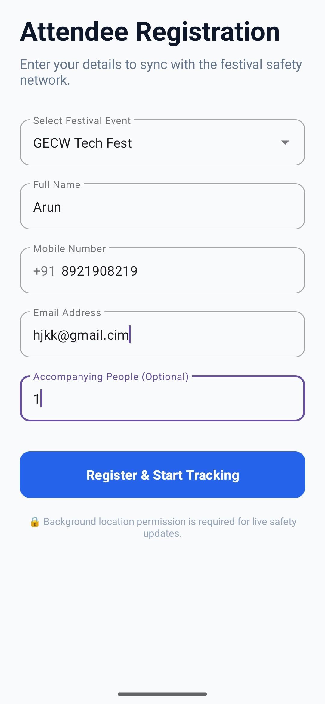
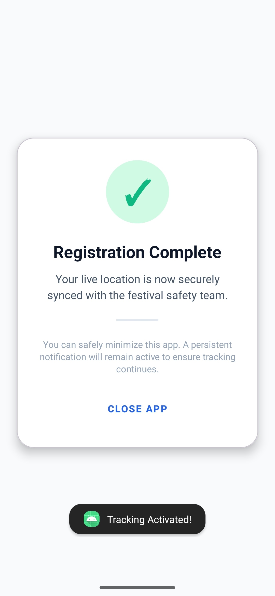

# Attendee Registration App (Android)

This directory contains the Android application source code for the **CrowdDense** Attendee tracker. Built using Java and the Android SDK, this app allows festival-goers to register for specific events and securely share their live location in the background with the central safety system.

---

## User Interface

The app is designed to be frictionless, requiring only a one-time registration before fading into the background to maintain continuous safety tracking.

### 1. Registration Screen
Attendees select the active festival from a dynamically loaded dropdown (fetched from the Django API) and enter their basic details.

### 2. Success & Tracking Screen
Upon successful registration, the app locks the UI to prevent accidental re-registrations. It instructs the user to safely minimize the app, utilizing a foreground service to keep tracking active.

---

## Core Architecture & Components

The application relies on three main Java classes to handle network requests, UI flow, and background location services.

### `MainActivity.java`
* **Dynamic Event Loading:** Uses the Volley library (`JsonArrayRequest`) to fetch the list of active events from the backend and populates an `AutoCompleteTextView`.
* **Registration Handling:** Captures user inputs (Name, Phone, Email, Accompanied count) and submits them via a POST request (`JsonObjectRequest`) to the `/api/register-attendee/` endpoint.
* **Service Initiation:** Upon a successful response, it extracts the unique `attendee_id`, starts the `LocationService`, and transitions the user to the `SuccessActivity`.

### `LocationService.java`
* **Foreground Tracking:** Operates as a sticky Android Foreground Service (`START_STICKY`). It creates a persistent system notification so the Android OS does not aggressively kill the process to save battery.
* **High-Accuracy GPS:** Utilizes Google's `FusedLocationProviderClient` to request high-accuracy location updates every 10 to 15 seconds.
* **Continuous Sync:** Fires a background POST request to `/api/update-location/` every time a new GPS coordinate is locked, sending the `attendee_id`, latitude, and longitude.

### `SuccessActivity.java`
* **Edge-to-Edge UI:** Implements modern Android window insets for a clean, full-screen layout.
* **Task Management:** Overrides both the physical back button and the on-screen "Close App" button with `moveTaskToBack(true)`. This intentionally prevents the user from accidentally killing the app, pushing it to the background instead so the `LocationService` can continue running uninterrupted.

---

## Tech Stack & Dependencies

* **Language:** Java
* **Network Interfacing:** Volley HTTP Library
* **Location Services:** Google Play Services Location API (`com.google.android.gms:play-services-location`)
* **UI Components:** AndroidX, Material Design Components

---

## Developer Notes & Setup

If you are running the backend locally, you must update the API base URLs in the Android source code before building the APK.

1. Locate the `BASE_URL` in `MainActivity.java`.
2. Locate the `UPDATE_URL` in `LocationService.java`.
3. Replace the placeholder Ngrok URLs (e.g., `https://douthdfnd-esarle-dressugfggly.ngrok-free.dev/...`) with your currently active tunneling URL or production server IP. 

**Required Permissions:**
Ensure the physical device or emulator has granted **Precise Location** and **Allow all the time** (Background Location) permissions for the service to function properly.
