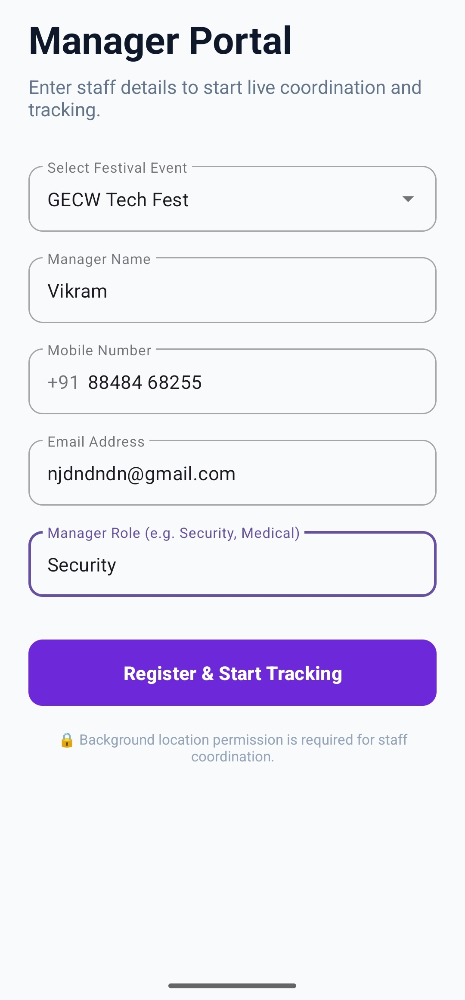
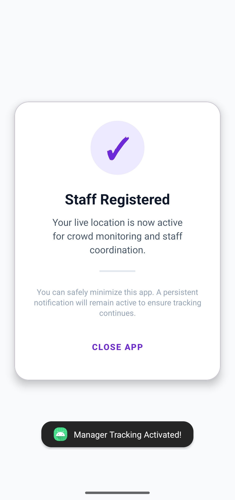

# Manager Registration App (Android)

This directory contains the Android application source code for the **CrowdDense** Manager tracking client. Built with Java and the Android SDK, this application is specifically designed for event staff, medical teams, and security personnel. It allows them to register their operational roles and broadcast their live coordinates to the central dashboard for rapid coordination.

---

## User Interface

The application is built for quick onboarding so staff can register and immediately return to their active duties while the app securely tracks their location in the background.

### 1. Staff Registration Screen
Managers select the active event from a dynamically populated dropdown menu and input their contact details. Crucially, this version includes a **Manager Role** field (e.g., Security, Medical) so the control room knows exactly what type of personnel they are tracking.

### 2. Success & Tracking Screen
After successful registration with the backend, the app transitions to a locked success screen. It instructs the staff member to safely minimize the application to keep the foreground location service running continuously.

---

## Core Architecture & Components

The app's logic is distributed across three primary Java classes, optimized for background execution and reliable network communication.

### `MainActivity.java`
* **Dynamic Event Loading:** Uses the Volley networking library (`JsonArrayRequest`) to fetch the list of active events from the Django backend and populates an `AutoCompleteTextView`.
* **Role-Based Registration:** Captures manager details and their specific role, sending a POST request (`JsonObjectRequest`) to the `/api/register-manager/` endpoint.
* **Service Hand-off:** Extracts the `manager_id` from the server response, boots up the `LocationService` by passing this ID as an Intent extra, and transitions to the `SuccessActivity`.

### `LocationService.java`
* **Persistent Foreground Service:** Runs continuously as a `START_STICKY` service. It spawns a persistent system notification so the Android OS knows this is a high-priority task and prevents it from being killed for battery optimization.
* **High-Accuracy GPS Tracking:** Leverages Google's `FusedLocationProviderClient` to ping device coordinates every 10 to 15 seconds.
* **Backend Synchronization:** Each time a new GPS lock is acquired, it fires a background POST request to the `/api/update-manager-location/` endpoint containing the `manager_id`, latitude, and longitude.

### `SuccessActivity.java`
* **Edge-to-Edge UI:** Utilizes modern Android window insets (`WindowInsetsCompat`) for a seamless full-screen layout.
* **Accidental Kill Prevention:** Overrides both the physical back button (`OnBackPressedCallback`) and the on-screen UI button. Instead of closing the activity, it executes `moveTaskToBack(true)`, purposefully pushing the app to the background to ensure the `LocationService` continues uninterrupted.

---

## Tech Stack & Dependencies

* **Language:** Java
* **Network Interfacing:** Volley HTTP Library
* **Location Services:** Google Play Services Location API (`com.google.android.gms:play-services-location`)
* **UI Components:** AndroidX, Material Design Components

---

## Developer Notes & Setup

Before building the APK for production or testing locally with Docker/Ngrok, you must update the API base URLs to match your current server routing.

1. Locate `BASE_URL` in `MainActivity.java`.
2. Locate `UPDATE_URL` in `LocationService.java`.
3. Replace the placeholder Ngrok URLs (`https://southbound-earle-pressuringly.ngrok-free.dev...`) with your live production IP or active tunneling address.

**Required Permissions:**
To function correctly, the Android device must grant **Precise Location** and **Allow all the time** (Background Location) permissions when prompted.
