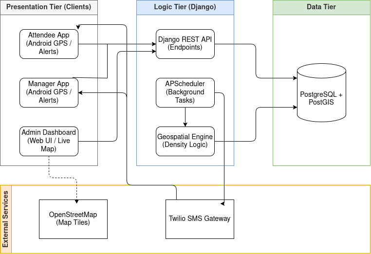
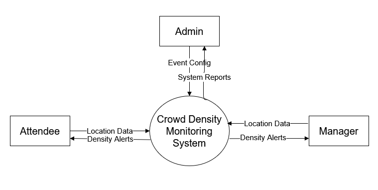
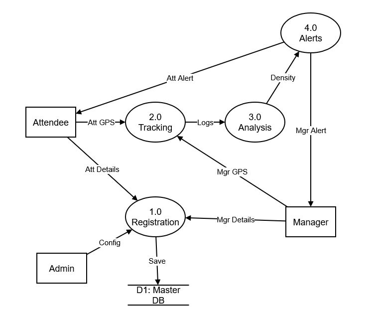
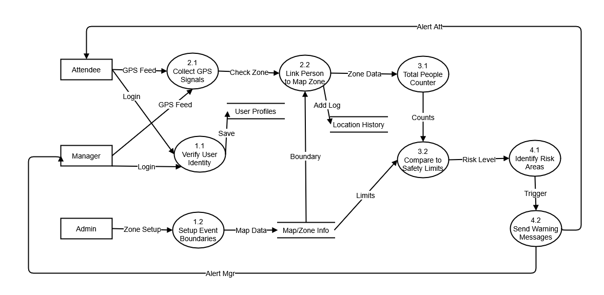

# Crowd Monitoring System for Festivals
**Real-Time Geospatial Safety & Alerting System**

This project is a high-performance safety solution for managing large-scale public gatherings. It combines a **Django/PostGIS** backend with an **Android-based GPS tracker** to monitor crowd density and trigger automated safety alerts in real-time.

---

## Design & UI (Figma)
The user interface of admin side and attendee registration are created using figma, and the links of them are provided.
* **[Admin Side Prototype](https://www.figma.com/design/ZCk6P6zzFQ9AN81zicw5e2/Crowd-Monitoring?node-id=0-1&t=QbpRbps1QhNrIn59-1)**
*  **[Attendee Side Prototype](https://www.figma.com/design/uwGTtUjbeBdfcmTBUkobzJ/Untitled?t=QbpRbps1QhNrIn59-1)**
---

## Key Features
* **Live GPS Tracking**: Real-time attendee location updates every 15 seconds.
* **Automatic Alert Triggering**: Backend logic calculates density within specific zones and triggers alerts via Twilio SMS if numbers exceed safe thresholds.
* **Geospatial Fencing**: Define event boundaries and "danger zones" using PostGIS polygon data.
* **Admin Control Center**: A secure web dashboard to manage events, zones, and live data.

---

## System Architecture & Data Flow

### Architecture Diagram

*A three-tier architecture illustrating the Presentation Tier (Android apps & Admin Web UI), Logic Tier (Django REST API, APScheduler for background tasks, and Geospatial Engine), Data Tier (PostgreSQL + PostGIS), and integrations with External Services (Twilio SMS and OpenStreetMap).*

### Data Flow Diagrams (DFD)

#### Level 0 DFD (Context Diagram)

*Context-level diagram showing the core Crowd Density Monitoring System and its high-level data exchanges with external entities: Attendees, Managers, and Admins.*

#### Level 1 DFD

*Breakdown of the primary system processes: Registration (1.0), Tracking (2.0), Analysis (3.0), and Alerts (4.0), alongside their interactions with the Master Database.*

#### Level 2 DFD

*A granular view detailing internal processes such as identity verification, event boundary setup, GPS signal collection, linking attendees to map zones, continuous people counting, safety limit comparisons, and the triggering of warning messages to managers and attendees.*

## Tech Stack
* **Backend**: Python 3.x, Django 5.x, PostgreSQL/PostGIS.
* **Mobile**: Java, Android SDK, Android Studio.
* **Design**: Figma (UI/UX).
* **SMS Gateway**: Twilio API.
* **Infrastructure**: Docker, Docker Compose.
* **Networking**: Ngrok for secure HTTPS tunneling (only used in development phase and testing).
---

## Getting Started

### Prerequisites
1. **Docker Desktop** installed and running.
2. **Twilio Account**: You will need your `Account SID`, `Auth Token`, and a `Twilio Phone Number`.

### Installation & Setup

1. **Clone the repository**
   ```bash
   git clone https://github.com/akhil-codec/CrowdDense/
   cd CrowdDense
   ```


2. **Environment Configuration**

   Create a .env file in the root directory and add your credentials:
   ```bash
   POSTGRES_DB=crowd_db
   POSTGRES_USER=postgres
   POSTGRES_PASSWORD=your_password
   DATABASE_url=your_database_url
   TWILIO_ACCOUNT_SID=your_sid_here
   TWILIO_AUTH_TOKEN=your_token_here
   TWILIO_PHONE_NUMBER=your_twilio_number
   ```


3. **Build and Launch with Docker**
   
   Ensure Docker Desktop is started, then run:
   ```bash
   docker compose --build
   docker compose up -d
   ```


5. **Database Migrations**
   ```bash
   docker compose exec web python manage.py migrate
   docker compose exec web python manage.py createsuperuser
   ```


6. **HTTPS Tunneling using Ngrok**

   You will require a ngrok account and also ngrok should be installed in the system
   ```bash
   ngrok http 8000
   ``` 
