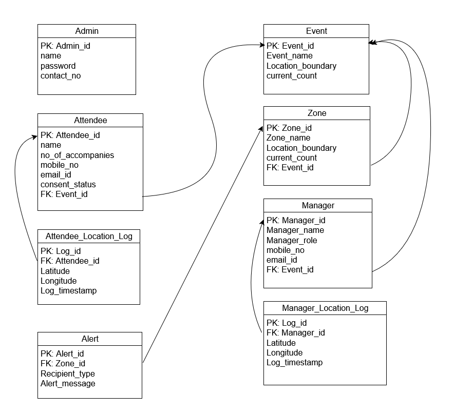
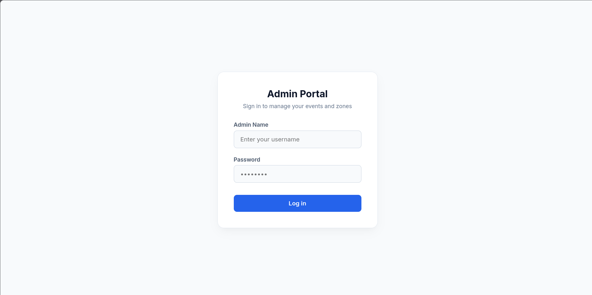
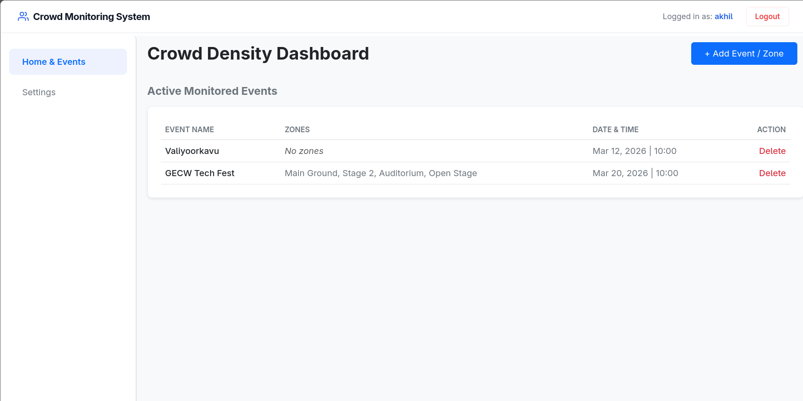
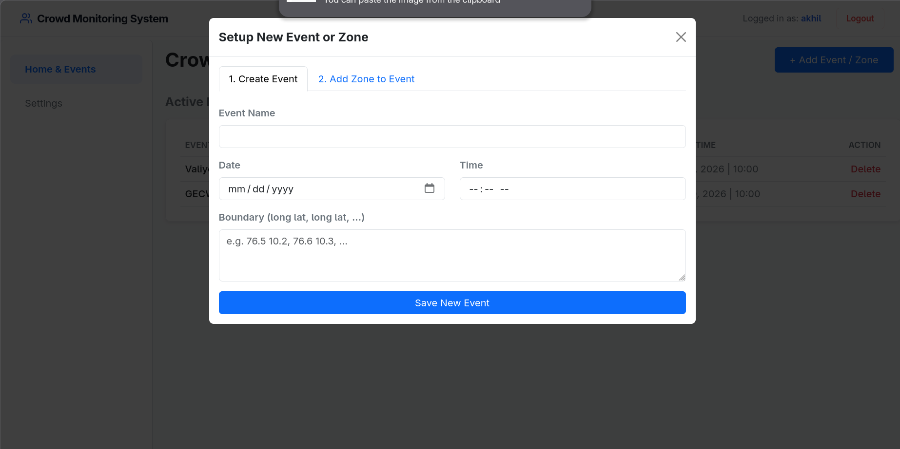
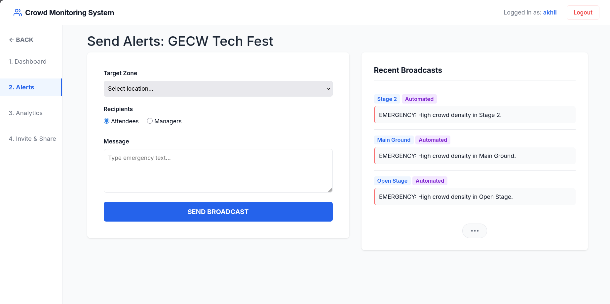
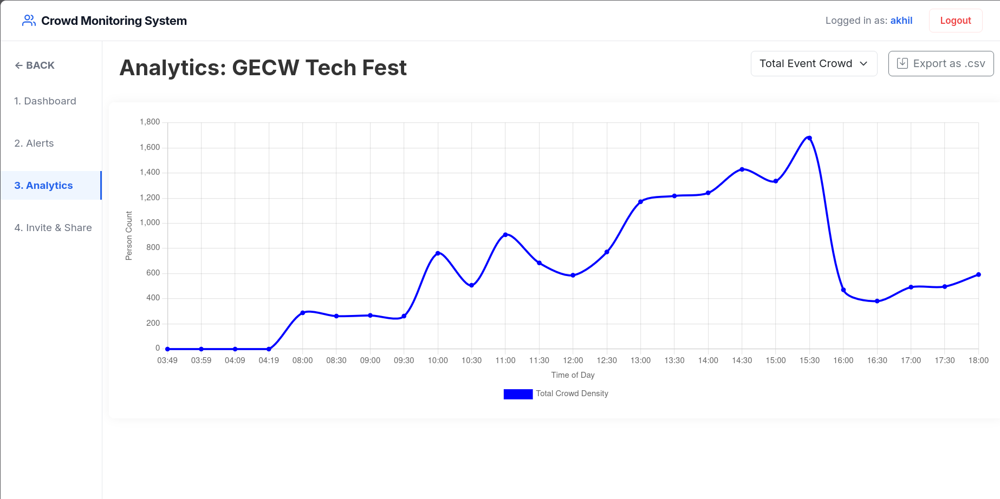
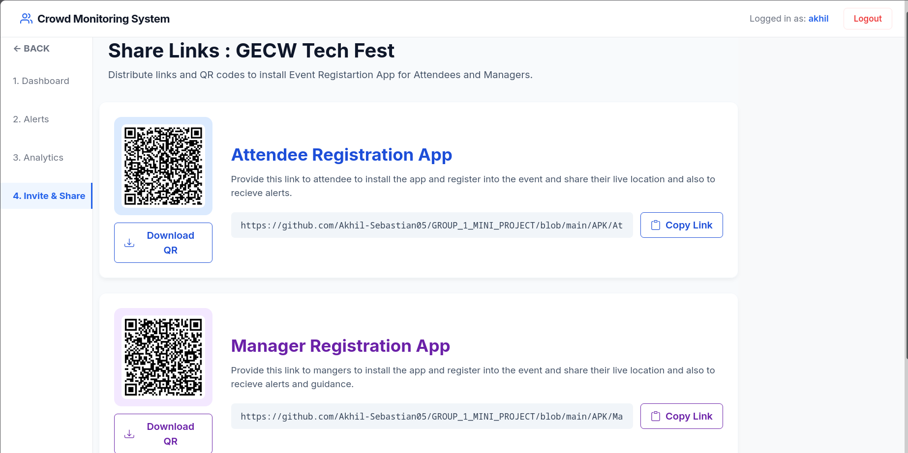

# Crowd Monitoring Backend & Admin Portal (`crowd_monitoring`)

This directory contains the core Django application for the **CrowdDense** project. It serves as the central nervous system of the platform, handling the REST APIs for mobile clients, running complex PostGIS geospatial queries, and serving the web-based Admin Control Center.

---

## Database Schema

The system uses a relational structure optimized for both user management and high-frequency geospatial data logging. 

### Core Models:
* **Admin**: Stores credentials and contact info for dashboard access.
* **Event & Zone**: The foundational spatial models. Events have a master `Location_boundary` (Polygon), and can contain multiple smaller Zones with their own boundaries and `current_count` trackers.
* **Attendee & Manager**: User profiles linked to specific events, storing contact info for SMS alerts and registration details.
* **Location Logs (`Attendee_Location_Log` & `Manager_Location_Log`)**: High-throughput tables storing the real-time Latitude, Longitude, and Timestamps of users. 
* **Alert**: Logs the history of SMS broadcasts sent to specific zones and recipient types.

---

## Admin Control Center UI

The web portal provides event organizers with a clean, intuitive interface to monitor and manage large gatherings in real-time.

### 1. Secure Access
Administrators must authenticate to access the event management system and live data feeds.

### 2. Event & Zone Management
Admins can view active monitored events, delete old ones, or set up entirely new events and danger zones by defining PostGIS polygon boundaries.

### 3. Live Geospatial Dashboard
The core feature of the portal. It maps attendees (blue dots) and managers (red dots) in real-time within the defined event zones. It calculates and displays the live density (`current_count`) for each specific sector (e.g., Stage 2, Auditorium, Main Ground).

### 4. Alert Broadcasting
If a zone breaches safe capacity limits, admins can use this interface to dispatch targeted Twilio SMS emergency broadcasts to either Attendees or Managers currently inside that specific area.

### 5. Crowd Analytics & Exports
A historical breakdown of crowd density over time. Admins can view the timeline graph to identify peak crowding hours across the total event or specific zones, and export this data as a `.csv` for post-event review.

### 6. App Distribution (Invite & Share)
A centralized hub to distribute the required Android APKs. Organizers can display or download QR codes, or copy direct links, to allow Attendees and Managers to easily install the tracking applications.

---

## Key Backend Modules

* `models.py`: Defines the PostgreSQL/PostGIS database schema.
* `views.py`: Contains the logic for both the Admin UI rendering and the REST API endpoints (`/api/register/`, `/api/location/update/`) used by the Android apps.
* `urls.py`: Maps web routes to their respective views and API endpoints.
* `templates/`: Contains the HTML/Bootstrap frontend for the dashboard screenshots shown above.
